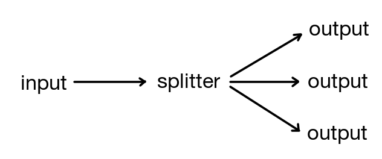

# gosplitter

 

This repository contains a channel splitter which broadcasts messages received from an input channel to a dynamic amount of output channels.

## Installation

    go get github.com/NIPE-SYSTEMS/gosplitter

## Cretae a new splitter

NewSplitter() creates a new splitter from a given input channel. It returns an add function that may be used for adding more
outputs to the splitter. The add function returns a new output channel with the given capacity and a remove
function. To prevent memory leaks the remove function must be called when the output channel is no longer needed.

Create splitter:

    input := make(chan interface{})
    add := NewSplitter(input, capacity)

Add output channel:

    output, remove := add()
    defer remove() // ensure that output gets removed

## License

MIT
